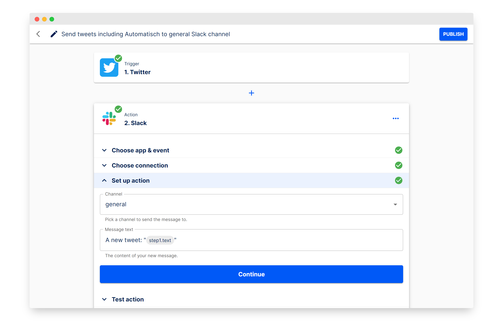

# Automatisch CI/CD pipeline

Deploy Automatisch with CI/CD on Elestio

 
 

# Once deployed ...

You can open Automatisch UI here:

    URL: https://[CI_CD_DOMAIN]
    email: [ADMIN_EMAIL]
    password: [ADMIN_PASSWORD]
    
Important: If the provided password doesn't work during your initial login, please use `sample` to log in. Remember to change your password afterward from the settings page at https://[CI_CD_DOMAIN/settings/profile.
